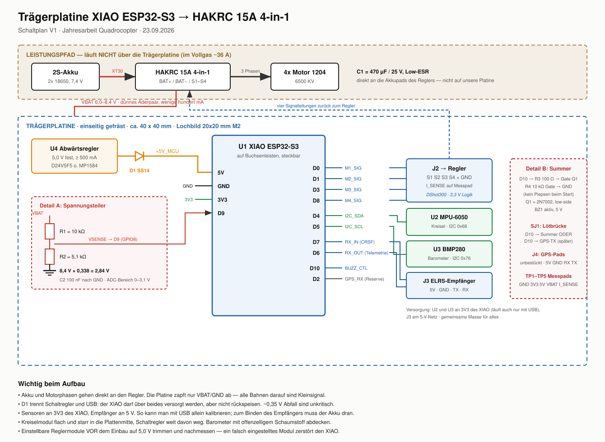

# Die eigene Trägerplatine

*Das Herzstück des Eigenbaus: eine selbst entworfene Leiterplatte, gefräst auf der
CNC 1310.*

Sie sitzt zwischen dem XIAO ESP32-S3 und dem 4-in-1-Regler und ersetzt an einer Stelle:
Kreiselmodul samt Verkabelung, 5-V-Reglermodul, Spannungsteiler und Steckerchaos.

## Warum überhaupt eine eigene Platine

Nicht aus Ehrgeiz, sondern weil die Alternative schlechter fliegt:

> **Ein Kreisel an fliegenden Drähten ist der häufigste Grund für eine Drohne, die sich
> nicht abstimmen lässt.**

Die Flugregelung filtert die Vibrationen heraus, die der Sensor meldet. Sitzt der Sensor
wackelig an Kabeln, misst er die Schwingung der Kabel mit — und die Regelung filtert dann
gegen ein Problem an, das der Aufbau selbst erzeugt. Ein starr und definiert montierter
Sensor ist die Grundlage für alles Weitere.

Die Platine ist dadurch leichter als die Summe der Einzelteile, und sie ist der eigene
Entwicklungsanteil, den eine Jahresarbeit braucht.

## Die Fertigung bestimmt den Entwurf

> **Die 1310 fräst einseitige Platinen ohne durchkontaktierte Löcher**, mit Bahnbreiten um
> 0,2–0,3 mm.

Das hat eine harte Folge: **Ein nackter Sensorchip im QFN- oder LGA-Gehäuse ist damit nicht
sinnvoll bestückbar.** Sein Anschlussraster misst 0,5 mm, und unter dem Bauteil kann ohne
Durchkontaktierungen nichts geroutet werden.

**Die Lösung: fertige Sensormodule aufsetzen.** Die Platine bekommt Lötpads im
2,54-mm-Raster für ein MPU-6050- und ein BMP280-Modul. Die werden **flach und starr**
aufgelötet oder auf kurze Stiftleisten gesteckt — nicht an Kabeln. Mit gefrästen Bahnen
problemlos machbar, und es erreicht das Wesentliche: definierte, steife Sensormontage.

Wer später den nackten Chip will, lässt die Platine industriell fertigen (JLCPCB o.ä.).
Für Stufe 2 (eigener Regler) wird das ohnehin nötig.

## Sensor für Sensor

### Kreisel und Beschleunigungssensor — Pflicht

Ohne ihn gibt es keine Flugregelung. **Gewählt: MPU-6050 über I2C** — nicht weil er der
beste ist, sondern weil ein SPI-Kreisel vier Anschlüsse kostet und dann kein Platz mehr für
Barometer und Summer bliebe. Begründung ausführlich in
[`03-elektronik.md`](03-elektronik.md).

### Barometer — ja, klar

**Kostet null zusätzliche Anschlüsse** (er hängt am selben I2C-Bus) und schaltet die
**Höhenhaltung** frei. Gewählt: **BMP280**.

> Für jemanden, der zum ersten Mal einen bürstenlosen Quadrocopter fliegt, ist Höhenhaltung
> kein Luxus, sondern der Unterschied zwischen „schwebt" und „hüpft". Und bei der
> Vorführung der Jahresarbeit will man die Höhe nicht von Hand halten müssen.

**Einbau:** Der Drucksensor muss vor Propellerwind und vor Licht geschützt werden — beides
verfälscht die Messung. Ein Tropfen **offenzelliger Schaumstoff** darüber. Nicht zukleben,
er muss den Umgebungsdruck noch messen können.

### Magnetometer (Kompass) — nein

Kostet ebenfalls null Anschlüsse, nützt aber **ohne GPS praktisch nichts**: Der Kompass
dient der Navigation, nicht der Lageregelung. Dazu säße er wenige Zentimeter neben
Leitungen, durch die 36 A fließen — die Störung wäre größer als der Nutzen.

### GPS — nicht in Version 1, aber Pads vorsehen

Drei Gründe dagegen: Es bräuchte eine eigene UART, also zwei Anschlüsse, die nicht frei
sind. Ein Modul wiegt 5–10 g, bei 164 g Abfluggewicht also 3–6 %. Und der eigentliche
Nutzen — die Rückkehrautomatik — setzt ein sauber abgestimmtes Fluggerät voraus, das wir am
Anfang nicht haben.

Aber: **zwei unbestückte Lötpads für RX/TX plus 5 V und Masse kosten nichts** und lassen
die Tür offen. Entfällt später der Summer, ist GPS nachrüstbar.

### Strommessung — Messpad statt Anschluss

Der HAKRC hat einen Strommesser eingebaut. Sein Ausgang bräuchte einen ADC-Anschluss, den
wir für die **Spannung** verwenden — bei Lithium-Ionen-Zellen ist die
Tiefentladungsgrenze das, was man wirklich überwachen muss. Den Stromausgang führen wir auf
ein **Messpad**: kostet nichts und macht die Messung am Boden zugänglich.

## Was sonst auf die Platine gehört

| Funktion | Warum |
|---|---|
| **5-V-Schaltregler** aus 2S (6,0–8,4 V) | der HAKRC hat **kein BEC**; versorgt XIAO, Empfänger, Sensoren |
| **Schottky-Diode** im 5-V-Zweig | verhindert Rückspeisung, wenn USB und Akku gleichzeitig hängen |
| **Spannungsteiler 10 kΩ / 5,1 kΩ** | Akkuspannung messen, Tiefentladungswarnung |
| **Stützkondensator** 220–470 µF / 25 V | fängt die Spannungsspitzen der Regler ab |
| **Summer** | Warnung bei leerem Akku **und Suchhilfe nach dem Absturz** — beides praktisch unverzichtbar |
| **Lochbild 20 × 20 mm M2** | passend zum Regler; Softmount mit Gummitüllen zum Rahmen |
| **Messpads** für GND, 3V3, 5V, VBAT, Strom | Fehlersuche mit dem Multimeter, und gut für die Doku |
| **Steckverbinder statt Lötstellen**, wo möglich | nach einem Absturz tauschen statt entlöten |

> Das **Softmount** ist kein Beiwerk, sondern die zweite Hälfte der Antwort auf „warum eine
> eigene Platine": Sensor starr auf der Platine, Platine weich gegen den Rahmen.

## Der Schaltplan



*(Auch als [PNG](bilder/traegerplatine-schaltplan.png).)*

### Grundgedanke: der große Strom läuft nicht über unsere Platine

Das Wichtigste vorweg, weil es den ganzen Entwurf vereinfacht: **Akku und Motorphasen gehen
direkt an den Regler, nicht über unsere Platine.** Dort fließen im Vollgas ~36 A — die
wollen wir nicht auf einer gefrästen Leiterplatte haben.

Unsere Platine zapft am Regler nur `VBAT` und `GND` mit einem dünnen Aderpaar ab und zieht
daraus wenige hundert Milliampere. Alle Bahnen darauf sind Signal- oder
Kleinleistungsbahnen.

```
   Akku (2S) --XT30--> Regler BAT+/BAT-   (dort C1 = 470 uF direkt an die Pads)
                              |
                              +-- duennes Aderpaar --> unsere Platine (VBAT, GND)
                              |
                              +-- Motorphasen --> 4 Motoren
```

### Netzliste

| Netz | Von | Nach |
|---|---|---|
| **VBAT** (6,0–8,4 V) | Regler BAT+ | U4 Buck IN+, R1, TP_VBAT |
| **GND** | Regler BAT− | alles |
| **+5V** | U4 Buck OUT+ | C3, D1 Anode, J3-1 (ELRS VCC), J5-1 (Kamera/VTX), BZ1+, TP_5V |
| **+5V_MCU** | D1 Kathode | U1 Pin `5V` |
| **+3V3** | U1 Pin `3V3` | U2 VCC, U3 VCC, TP_3V3 |
| **VSENSE** | R1 / R2 Mittelpunkt | U1 `D9` (GPIO8), C2 |
| **I2C_SDA** | U1 `D4` (GPIO5) | U2 SDA, U3 SDA |
| **I2C_SCL** | U1 `D5` (GPIO6) | U2 SCL, U3 SCL |
| **M1_SIG** | U1 `D0` (GPIO1) | J2-1 → Regler S1 |
| **M2_SIG** | U1 `D1` (GPIO2) | J2-2 → Regler S2 |
| **M3_SIG** | U1 `D3` (GPIO4) | J2-3 → Regler S3 |
| **M4_SIG** | U1 `D8` (GPIO7) | J2-4 → Regler S4 |
| **RX_IN** (CRSF) | J3-3 (ELRS TX) | U1 `D7` (GPIO44) |
| **RX_OUT** (Telemetrie) | U1 `D6` (GPIO43) | J3-4 (ELRS RX) |
| **BUZZ_CTL** | U1 `D10` (GPIO9) | SJ1 → R3 → Q1 Gate |
| **BUZZ_LOW** | Q1 Drain | BZ1− |
| **GPS_RX** (unbestückt) | U1 `D2` (GPIO3) | J4-3 |
| **GPS_TX** (unbestückt) | SJ1 Alternativstellung | J4-4 |
| **I_SENSE** | Regler Stromausgang | TP_ISENSE (**nicht** am Mikrocontroller) |

### Stückliste

| Pos | Bauteil | Wert / Typ | Bemerkung |
|---|---|---|---|
| U1 | XIAO ESP32-S3 | — | auf 2 × 7-polige Buchsenleisten 2,54 mm, steckbar |
| U2 | Kreiselmodul | MPU-6050 (GY-521) | 8-polig, flach und starr auflöten |
| U3 | Barometermodul | BMP280, I2C-Ausführung | 4-polig |
| U4 | Abwärtsregler | 5 V fest, **≥ 1,5 A** | z.B. Pololu D24V22F5; wegen Kamera + Videosender nicht mehr der 500-mA-Typ |
| D1 | Schottkydiode | SS14 / B5819W | im 5-V-Zweig zum XIAO |
| D2 | Freilaufdiode | 1N4148 | nur bei magnetischem Summer nötig |
| Q1 | N-Kanal-MOSFET | 2N7002, SOT-23 | schaltet den Summer |
| R1 | Widerstand | 10 kΩ, 0805 | Spannungsteiler oben |
| R2 | Widerstand | 5,1 kΩ, 0805 | Spannungsteiler unten |
| R3 | Widerstand | 100 Ω, 0805 | Gatewiderstand |
| R4 | Widerstand | 10 kΩ, 0805 | Gate nach Masse |
| R5, R6 | Widerstand | 4,7 kΩ, 0805 | I2C-Pull-ups, **unbestückt** (Module bringen eigene mit) |
| C1 | Elko | 470 µF / 25 V, Low-ESR | **an die Akkupads des Reglers**, nicht auf unsere Platine |
| C2 | Kondensator | 100 nF, 0805 | am Spannungsteiler |
| C3 | Kondensator | 10 µF, 0805 | am 5-V-Ausgang |
| BZ1 | Summer | aktiv, 5 V, 12 mm | mit eigener Tonerzeugung |
| J2 | Stiftleiste | 6-polig 2,54 | zum Regler: S1–S4, GND, I_SENSE |
| J3 | Stiftleiste | 4-polig 2,54 | ELRS: 5V, GND, TX, RX |
| J4 | Lötpads | 4-polig, **unbestückt** | GPS für später |
| J5 | Stiftleiste | 2-polig 2,54 | Kamera + Videosender: 5V, GND |
| SJ1 | Lötbrücke | — | D10 wahlweise auf Summer **oder** GPS-TX |
| TP1–TP5 | Messpads | — | GND, 3V3, 5V, VBAT, I_SENSE |
| — | Bohrungen | 4 × Ø2,2 mm, Raster 20 × 20 mm | M2, passend zum Regler |

## Die vier Stellen, an denen man es falsch machen kann

### 1. Der Spannungsteiler

R1 = 10 kΩ, R2 = 5,1 kΩ ergibt ein Teilerverhältnis von 0,338. Bei vollen 8,4 V kommen
**2,84 V** am Messeingang an. Der ESP32-S3 verträgt dort etwa 0–3,1 V — passt mit etwas
Luft.

> **Niemals den Akku direkt an einen Anschluss des Mikrocontrollers legen.** 8,4 V an einem
> 3,3-V-Eingang zerstören den Chip.

In ESP-FC wird der Faktor über `vbat_scale` abgeglichen; am besten mit dem Multimeter
gegenmessen und den Wert anpassen.

### 2. Die Diode D1 und der USB-Konflikt

Der XIAO kann über USB **und** über den 5-V-Anschluss versorgt werden. Beides gleichzeitig
ohne Entkopplung ist eine Einladung zum Rückspeisen — der Schaltregler würde in den
USB-Anschluss des Rechners drücken. **D1 lässt Strom nur vom Schaltregler zum XIAO.**

Der Spannungsabfall von ~0,35 V an der Diode ist unkritisch: Der XIAO braucht am
5-V-Anschluss nur mehr als etwa 4 V für seinen internen 3,3-V-Regler.

### 3. Sensoren an 3V3, nicht an 5V

Kreisel und Barometer hängen am **3V3-Anschluss des XIAO**. Damit laufen sie auch, wenn nur
das USB-Kabel steckt — man kann also am Schreibtisch kalibrieren und einstellen, ohne den
Akku anzuschließen. Eine kleine Entscheidung mit großem Komfortgewinn.

Der ELRS-Empfänger hängt dagegen am 5-V-Netz; zum Binden muss der Akku dran sein oder 5 V
am Messpad eingespeist werden.

### 4. Das Summer-Gate nach Masse

R4 zieht das Gate von Q1 beim Einschalten nach Masse. **Ohne diesen Widerstand piepst der
Summer, solange der Mikrocontroller startet** und seine Anschlüsse noch undefiniert sind.
Ein Bauteil für wenige Cent, das viel Ärger spart. Ob ESP-FC den Ausgang aktiv-hoch oder
aktiv-niedrig schaltet, stellt man mit `buzzer_inverted` ein.

## Hinweise für Layout und Fräsen

- **Einseitig, keine Durchkontaktierungen.** Zwei bis drei Drahtbrücken sind normal und
  völlig in Ordnung — besser eine saubere Brücke als eine gequälte Leiterführung.
- Massefläche auf der einen Lage, großzügig. Signalbahnen 0,3 mm, VBAT- und 5-V-Bahnen
  mindestens 0,8 mm.
- **Das Kreiselmodul in die Mitte der Platine**, möglichst nah an der Drehachse des
  Quadrocopters und flach aufliegend. Nicht an den Rand, nicht auf lange Stiftleisten.
- **Den Schaltregler weit weg vom Kreisel** — er schaltet mit einigen hundert Kilohertz und
  strahlt ein.
- Platinengröße etwa **40 × 40 mm**, Lochbild 20 × 20 mm mittig.
- **Auf 1,0 mm FR4 fräsen statt 1,6 mm** — spart rund 1,8 g.

## Gewicht, ehrlich gerechnet

| | |
|---|---|
| Leiterplatte 40 × 40 mm, 1,0 mm FR4 | ~3,0 g |
| MPU-6050-Modul | ~2,0 g |
| BMP280-Modul | ~0,5 g |
| Schaltreglermodul | ~1,5 g |
| Buchsen- und Stiftleisten, Kleinteile | ~1,5 g |
| Summer | ~1,5 g |
| **Summe** | **~10 g** |

Im ursprünglichen Budget standen 5 g Platine + 1,5 g Kreisel = 6,5 g. Es werden also **rund
3,5 g mehr**, das Abfluggewicht steigt auf ~164 g, die Flugzeitschätzung rutscht von 11–19
auf **11–18 min**. Kein Drama — aber genau der Grund, warum 1,0-mm-Material und kleine
Module sich lohnen.

## Was vor dem Löten noch zu klären ist

1. **Pad-Beschriftung des HAKRC.** Liegt noch nicht vor, der Regler ist unterwegs. Vor dem
   Layout am gelieferten Bauteil prüfen: Heißen die Signalpads S1–S4 oder M1–M4, wo liegt
   GND, ist ein Stromausgang herausgeführt?
2. **Ausgangsspannung des Schaltreglers.** Bei einstellbaren Modulen (MP1584) **vor dem
   Einbau** auf 5,0 V trimmen und nachmessen. Ein falsch eingestelltes Modul zerstört den
   XIAO.
3. **Verträgt der ELRS-Empfänger 5 V am Eingang?** Die meisten Nano-Empfänger ja, einige
   wollen 3,3 V. Datenblatt prüfen, bevor J3 verdrahtet wird.
