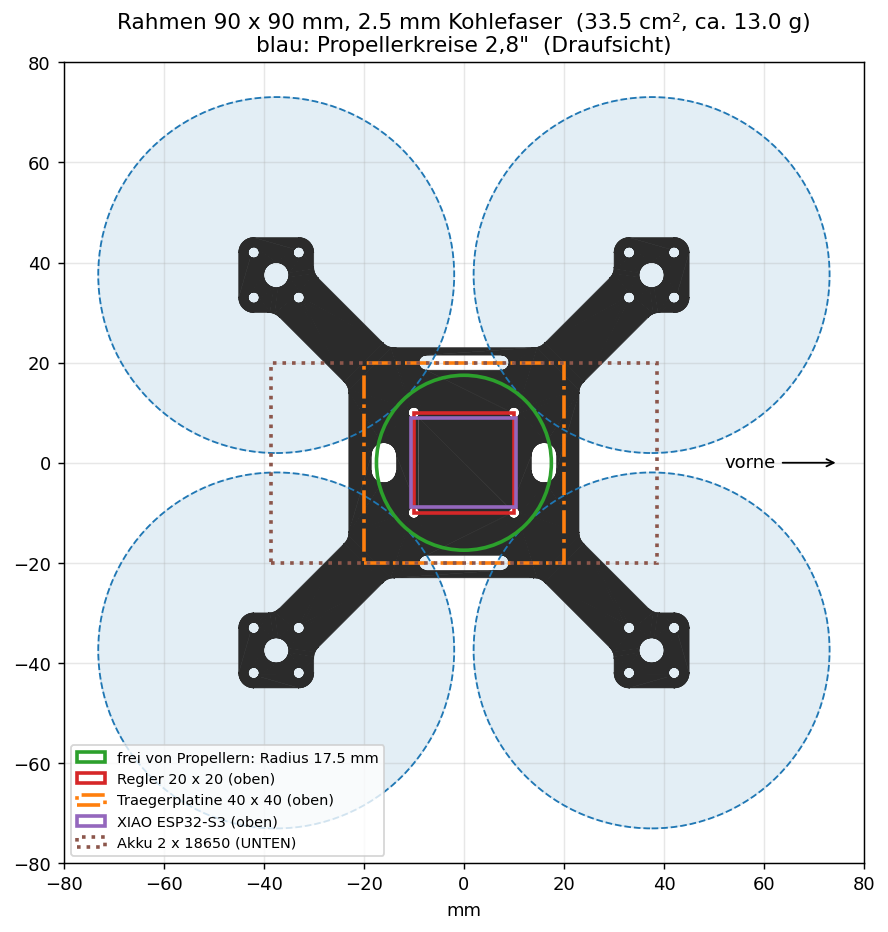

# CAD: Rahmen



Erster Entwurf des Rahmens, 25.09.2026. Das Modell wird **aus einem Programm erzeugt**
([`rahmen.py`](rahmen.py), CadQuery). Wer ein Maß ändern will, ändert die Zahl oben in der
Datei und lässt das Programm neu laufen, dann passen alle Dateien wieder zusammen.

| Datei | Wofür |
|---|---|
| `rahmen.step` | 3D-Modell zum Öffnen in Fusion 360 oder FreeCAD |
| `rahmen.dxf` | 2D-Kontur für das Fräsprogramm der CNC 1310 (echte Kreise und Bögen) |
| `rahmen.stl` | zum Anschauen, oder als 3D-Druck-Probeteil |
| `rahmen-vorschau.png` | Draufsicht mit Propellern, Regler, Platine und Akku |

## Die Maße

| | |
|---|---|
| Außenmaß | 90 × 90 × 2,5 mm, Kohlefaser |
| Motorachsen | 7,5 mm vom Rand, also bei ±37,5 mm; Radstand 106 mm |
| Motorträger | 15 × 15 mm, 4 × M2 (Ø 2,2 mm) im 9 × 9-Quadrat, Mittelloch Ø 5 mm für das Wellenende |
| Arme | 11 mm breit, alle Ecken mit 3 mm ausgerundet |
| Rumpf | 46 × 46 mm |
| Regler | 4 × M2 im 20 × 20-Quadrat, mittig |
| Gurtschlitze | 2 × 18 × 3 mm links und rechts, für den Klettgurt des Akkus |
| Kabelschlitze | 8 × 5 mm vorne und hinten: Akkukabel nach oben, vorne Reserve für die Kamera |
| Fläche / Gewicht | 33,5 cm², **ca. 13 g** (Ziel war 12 g) |
| Spalt zwischen Nachbarpropellern | 3,9 mm |

Vorne ist **+X**, also die Seite zwischen zwei Armen.

## Was das Modell gezeigt hat

Beim Einzeichnen der Propellerkreise sind zwei Dinge aufgefallen, die man auf dem Papier
leicht übersieht:

**1. Der Akku muss unter den Rahmen.** Die 2,8"-Propeller überdecken in der Draufsicht fast
die ganze Fläche. Frei bleibt nur ein Kreis mit **17,5 mm Radius** um die Mitte (grün). Der
Akkuhalter ist ~77 × 40 mm groß und 20 mm hoch. Oben auf dem Rahmen würde er in die
Propeller ragen. Unter dem Rahmen stört er nicht, weil die Propeller oben sitzen. Deshalb
die Gurtschlitze: Der Akku wird von unten mit einem Klettgurt angeschnallt.

**2. Die Ecken der Trägerplatine liegen unter den Propellern.** Die Platine (40 × 40 mm) ragt
über den grünen Kreis hinaus. Das geht nur, solange sie **flach** bleibt und tiefer liegt
als die Propeller. Die Motorhöhe am gelieferten Motor nachmessen: Alles, was außerhalb des
grünen Kreises liegt, muss mit Luft unter der Propellerebene bleiben. Der XIAO (lila) liegt
innerhalb des Kreises und darf deshalb höher bauen. Wird es zu eng: Platinenecken
abschrägen.

## Neu erzeugen

```bash
python3 -m venv cadenv
./cadenv/bin/pip install cadquery matplotlib
./cadenv/bin/python rahmen.py
```

## Vor dem Fräsen

- Erst in **Holz oder MDF** probefräsen und einen Motor anschrauben.
- M2-Löcher sind mit 2,2 mm gezeichnet; mit einem 1,5-mm-Fräser spiralförmig ausfräsen.
- Kohlefaser: Maske FFP2/FFP3, Absaugung oder nass fräsen, Fräse abdecken.
